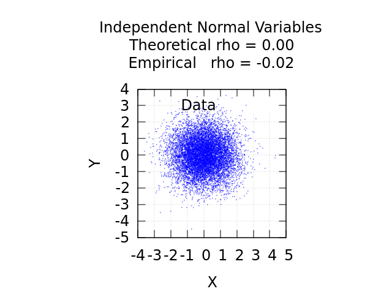
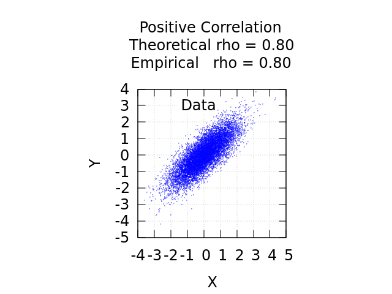
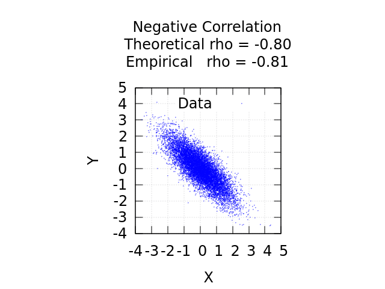

# Дополнительное задание: Генерация двумерного нормального распределения

## Описание алгоритма
Реализован алгоритм генерации пары зависимых случайных величин $(X, Y)$ с заданными математическими ожиданиями, дисперсиями и коэффициентом корреляции Пирсона $\rho$. 

Основа метода - линейное преобразование (на базе разложения Холецкого для ковариационной матрицы) двух независимых стандартных нормальных величин $Z_1, Z_2 \sim N(0, 1)$, которые формируются с помощью ранее реализованного генератора нормального распределения.

Формулы перехода:
$$X = \mu_x + \sigma_x Z_1$$
$$Y = \mu_y + \sigma_y (\rho Z_1 + \sqrt{1 - \rho^2} Z_2)$$

## Эмпирическое и графическое подтверждение
Тестирование показывает, что на выборках объемом 10 000 элементов эмпирическое значение $\hat{\rho}$ сходится к заданному теоретическому $\rho$ с высокой точностью (погрешность $\le 0.01$).

* При $\rho = 0.0$ величины статистически независимы, плотность распределения образует симметричный круг.
* При $\rho = 0.8$ присутствует положительная линейная зависимость, облако вытягивается в эллипс, направленный вправо-вверх.
* При $\rho = -0.8$ присутствует отрицательная зависимость, эллипс направлен вправо-вниз.

<table style="width:100%; text-align:center;">
  <tr>
    <td> $\rho = 0.0$</td>
    <td> $\rho = 0.8$</td>
    <td> $\rho = -0.8$</td>
  </tr>
</table>