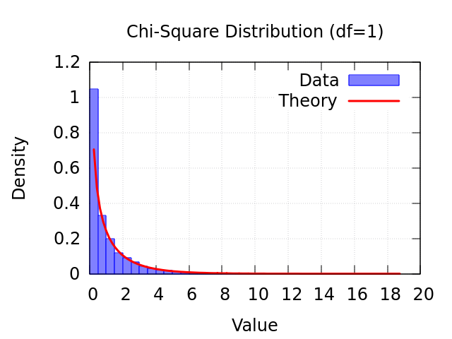
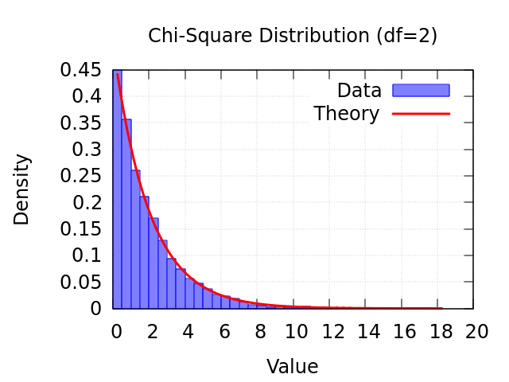
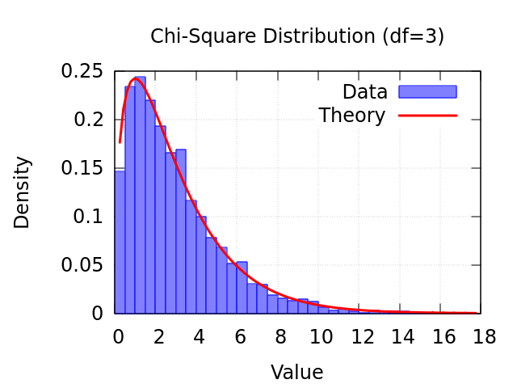
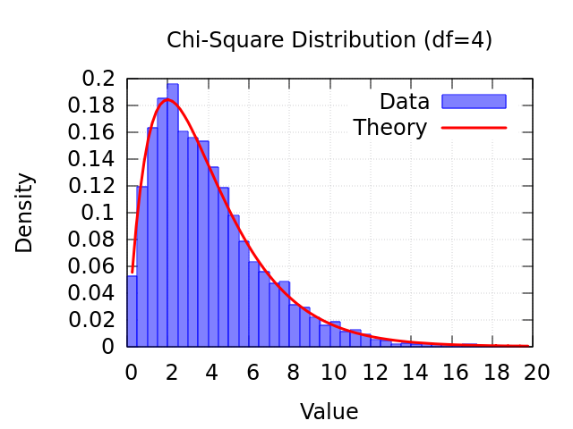
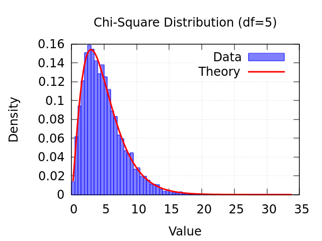
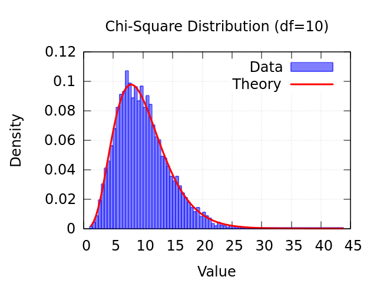

# Реализация генератора случайных чисел $\chi^2$

## 0. Компиляция и запуск
```zsh
cd task5_chi_square

cmake -B build -S . -DCMAKE_BUILD_TYPE=Release
cmake --build build -j$(nproc)         
```

```zsh
build/task5_chi_generator <degree number, default = 5>
```


$\chi^2$ внутри использует генератор чисел с нормальным распределением, а они оба под капотом используют генератор случайных чисел с равномерным распределением. Поэтому сначала нужно построить его. 

## 1. Генератор случайных чисел с равномерным распределением
Можно использовать готовые решения, здесь ради интереса и последующих тестов реализуем генератор **MRG32k3a** - это комбинированный рекурсивный генератор, состоящий из $J=2$ генераторов $k=3$ порядка.

## 2. Генератор случайных чисел с нормальным распределением
Стандартным методом является метод обратной функции, однако в случае нормального распределения этот метод вычислительно неэффективен из-за необходимости сложных численных аппроксимаций и проблемам с катастрофической потерей точности. Существует *полярный метод Марсальи*, о котором лучше читать из более компетентных источников. Здесь скажу лишь, что он значительно выигрывает по сложности, так как не требует вычисления полиномов высокой степени, синусов и косинусов. Имеет временную сложность $O(1)$, пространственную $O(1)$. 

## 3. Генератор $\chi^2$
В случае, когда степень свободы $n > 2$ генератор $\chi^2$ сводится к алгоритму для *Гамма-распределения* с параметром формы $k = n/2$ и параметром масштаба $\theta = 2$ (при $n \ge 2$). Генератор гамма-распределения использует генератор нормального распределения.

Запустив программу, увидим распределение сгенерированных чисел в сравнении с теоретическим. 

<table style="width:100%; text-align:center;">
  <tr>
    <td><br>k=1</td>
    <td><br>k=2</td>
    <td><br>k=3</td>
  </tr>
  <tr>
    <td><br>k=4</td>
    <td><br>k=5</td>
    <td><br>k=10</td>
  </tr>
</table>